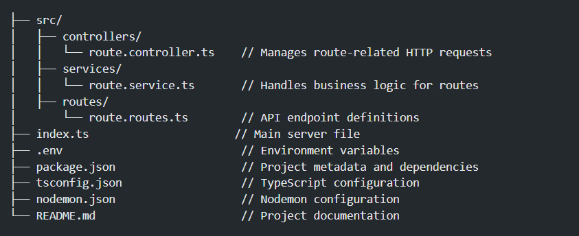

# Routes WayPoints Node.js REST API with TypeScript, And Express

## Overview

The Routes WayPoints project is a REST API built using **Node.js**, **TypeScript**, and **Express**, with a focus on managing routes and waypoints. The API supports CRUD operations (Create, Read, Update, Delete) for "Routes" — objects containing an `id`, `name`, and a list of `waypoints` (latitude and longitude coordinates).

## Features

- TypeScript for static typing
- Express for creating API endpoints
- CRUD operations for Route management
- In-memory data storage
- CORS enabled for cross-origin access
- Environment variables managed with `.env`
- Nodemon for automatic server reloads on changes

## System Requirements

- **Node.js**: v20.10.0
- **Yarn**: A package manager for managing dependencies

## Quick Start

### 1. Clone the Repository

```bash
git clone https://github.com/bayoudhali/-waypoints_map_backend.git
cd -waypoints_map_backend
```

### 2. Install Dependencies

Use Yarn to install the project dependencies:

```bash
git clone https://github.com/bayoudhali/-waypoints_map_backend.git
yarn install
```

### 3. Set Up Environment Variables

Create a .env file in the root of the project:

```bash
touch .env
```

Inside the .env file, add the following:

```bash
PORT=5000
```

### 4. Start the Application

To start the server in development mode (with Nodemon for automatic reloading):

```bash
yarn start
```

The server will be running on http://localhost:5000 (or any port specified in the .env file).

### Folder Structure


